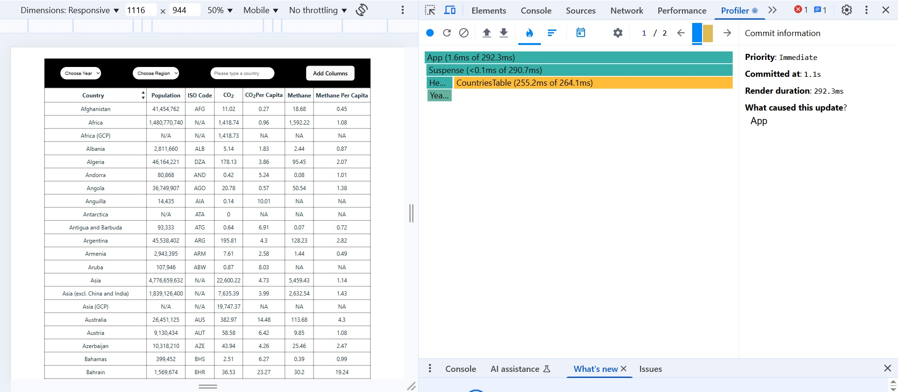
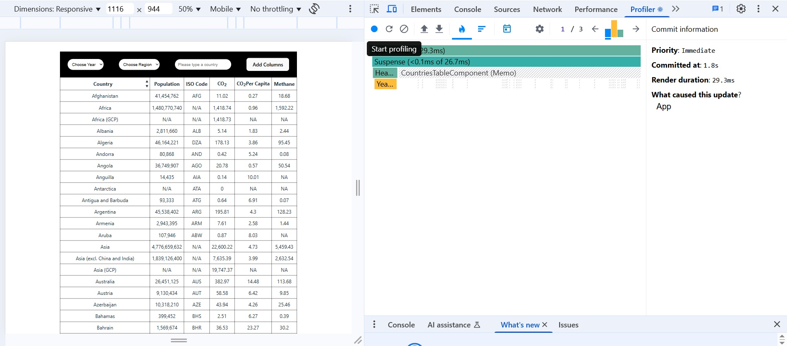
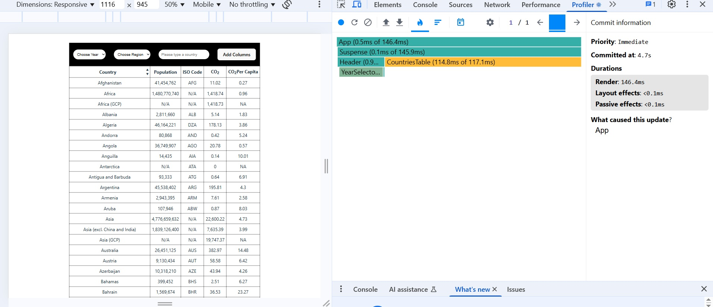
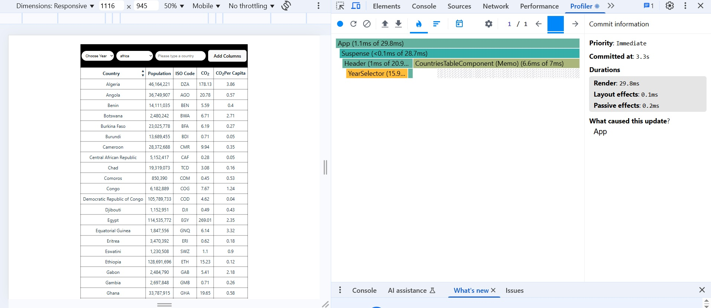
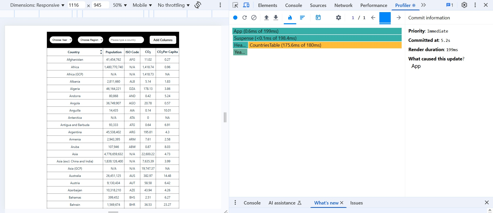
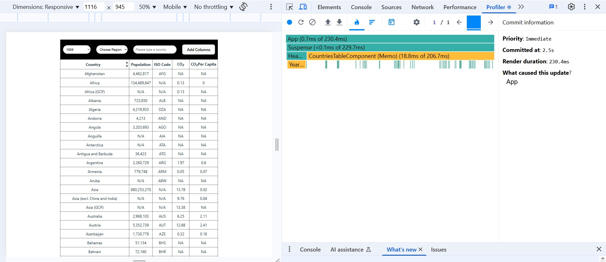
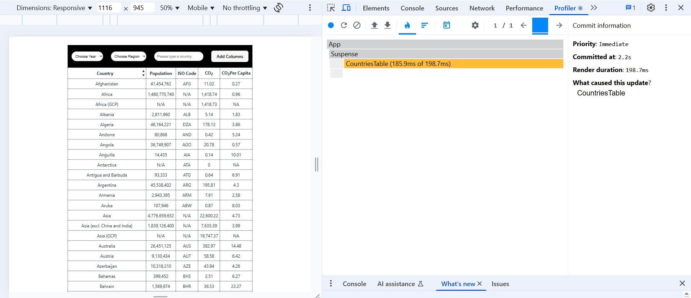
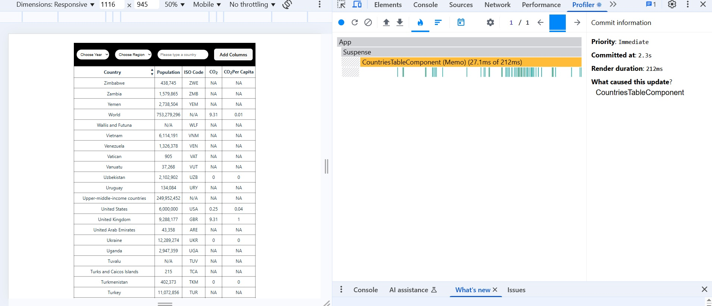

## App Performance

This app was profiled using React DevTools Profiler.
The screenshots below show the rendering performance during sorting and filtering actions.

### Add column without memoization

### Add column with memoization

### Filter by region without memoization

### Filter by region with memoization

### Filter by year without memoization

### Filter by year with memoization

### Sort by country without memoization

### Sort by country with memoization
